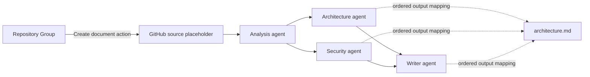
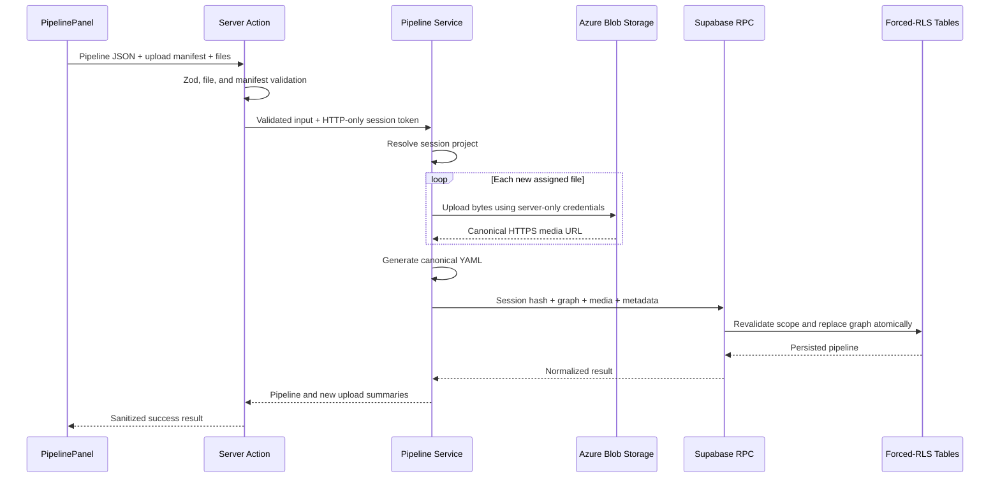

# Pipeline Builder: Workflow, Power, and Dynamicity

## 1. Purpose

The Pipeline Builder is the visual workflow-definition layer of TEK-DOC-MIND. It lets a project describe how repository context should move through one or more reusable AI agents and how selected node results should be arranged into document files.

The builder currently creates, validates, imports, exports, and persists pipeline definitions. It does **not** yet execute the graph, call the agents in dependency order, assemble generated files, or convert content into the selected output formats. A document action currently records a project-scoped request with type `CREATE` and state `NEW`; there is no worker or orchestration runtime that consumes that action yet.

This distinction matters:

- The current builder is a strong **workflow contract and graph authoring system**.
- The graph, agent references, file inputs, output mappings, and repository-group/action mapping are ready to drive a future executor.
- Runtime behavior such as retries, parallel execution, prompt composition, output conversion, and failure recovery still needs to be implemented.

## 2. Pipeline Mental Model

A pipeline has three related, but different, kinds of connections.

1. **Workflow edges** connect the GitHub source and agent nodes. They describe data dependencies and form a directed acyclic graph (DAG).
2. **Output mappings** connect node results to output-file targets. They describe file assembly order but are not workflow dependencies.
3. **Document actions** connect one saved Repository Group to one saved pipeline. This provides the concrete repository selection that the pipeline's source placeholder will eventually use at runtime.



In this example:

- `A -> B`, `A -> C`, `B -> D`, and `C -> D` are workflow edges.
- `B`, `C`, and `D` can be assembled into the same file in a chosen order, with optional section headers.
- The output mappings do not create execution dependencies. If a contributor must wait for another contributor, that relationship must also be represented by a workflow edge.

## 3. Core Building Blocks

### 3.1 GitHub Repository Group Source

Every pipeline contains exactly one source node. It is automatically created at the left side of a new canvas and cannot receive an incoming workflow edge.

The source node is deliberately a placeholder. The saved pipeline does not contain a Repository Group ID or GitHub credential. A concrete Repository Group is associated later when the user creates a document action.

This design allows one pipeline definition to be reused with different Repository Groups inside the same project.

Current source rules:

- Exactly one source node is required.
- The source starts the workflow and cannot be targeted by another node.
- Every agent node must be reachable from the source.
- At least one source-to-agent flow must exist before the pipeline can be saved.
- Mapping the source directly into an output file is optional.
- The source can have reusable project uploads in addition to its future repository context.

### 3.2 Agent Nodes

An agent node references a reusable project agent. The pipeline does not duplicate the agent configuration. The referenced agent owns its:

- connector and model;
- name and description;
- Markdown skills/instructions;
- output behavior: `single` or `multiple`;
- output type: `text`, `json`, `html`, `xml`, or `image`.

The builder can add an existing project agent or create and save a new agent without leaving the pipeline editor. The new agent becomes a normal reusable project resource before it is placed on the canvas.

Agent nodes support:

- one or more incoming workflow edges;
- one or more outgoing workflow edges;
- fan-out to parallel branches;
- fan-in from multiple upstream branches;
- direct mapping into one or more output files;
- reusable project-upload inputs and newly uploaded inputs;
- independent positioning on a bounded canvas.

The pipeline also stores a default connector and model as part of its canonical contract. The connector must exist in the project; the model is required, syntax-checked, and populated from live model discovery in the UI, but the database does not independently prove that the model remains available. In the current code, existing agent nodes continue to use their own saved connector/model, and the inline agent-creation dialog does not inherit the selected pipeline defaults. A future executor or UI enhancement can make the intended fallback/inheritance behavior explicit.

### 3.3 Workflow Edges

Workflow edges are directed links from one node to another. They express that the downstream agent will depend on the upstream node's result.

The builder dynamically supports:

- linear chains;
- multiple branches from one node;
- merging several branches into one agent;
- additional links between existing nodes;
- visual routing from `right`, `top`, `bottom`, or `left` source anchors.

The anchor changes the visual curve, not the workflow semantics.

The builder blocks:

- self-links;
- duplicate node-to-node links;
- links targeting the GitHub source;
- circular dependencies;
- disconnected agent nodes.

The graph is therefore a DAG and can eventually be executed in topological layers. Independent nodes in the same layer could run concurrently, while a fan-in node would wait for all required upstream results.

### 3.4 Output-File Targets

Any source or agent node can be marked with an output configuration. This creates a separate draggable file target on the canvas. The node holding the configuration is the target's storage owner; the actual contributors are controlled independently by `sourceNodeIds`.

Each output target defines:

- `parentPath`, such as `/` or `/docs/architecture`;
- a file name without slashes;
- a declared file type;
- a movable canvas position;
- an ordered list of contributing node IDs;
- an optional header of up to 200 characters for each contributor.

Supported declared output types are:

`html`, `xml`, `md`, `txt`, `json`, `png`, `jpeg`, `mermaid`, `yml`, `yaml`, `odt`, `rtf`, `docx`, `pdf`, `csv`, and `svg`.

Output mapping is highly dynamic:

- A node can contribute to multiple files.
- A file can combine results from multiple nodes.
- Contributors can be reordered at any time.
- Each contributor can have a different section header.
- A mapping can be added by dragging from a node to a file target or through the output dialogs.
- Every mapping can be removed independently, including the mapping from the node that originally created the file target.
- An output target may temporarily have no mapped contributors, but the pipeline must still contain at least one output target.

The selected type is currently declarative. For example, choosing `pdf` records the intended result but does not yet invoke a PDF renderer. Similarly, the ordered contributor list and headers are persisted, but no current service performs the assembly.

### 3.5 Node Media Inputs and Project Uploads

Every source or agent node can reference uploaded files. The same file can be assigned to multiple nodes.

There are two input sources:

- **Project uploads** are already stored in Azure Blob Storage and can be reused across pipelines and nodes in the same project.
- **Pending uploads** stay in browser memory until the user saves the pipeline. Only files assigned to at least one node are submitted.

On save:

1. The browser sends the pipeline JSON, an upload-to-node manifest, and the selected file bytes as multipart `FormData`.
2. The Server Action validates the graph, manifest, file names, MIME types, sizes, and node assignments.
3. The service derives the project from the live project session.
4. New file bytes are uploaded to the configured Azure container.
5. Their HTTPS URLs are appended to the assigned nodes.
6. Upload metadata and the normalized pipeline are committed through a project-scoped database RPC.
7. If persistence fails after an Azure upload, the service attempts to delete the newly uploaded blobs.

PostgreSQL stores upload metadata and media URLs, not file bytes. Uploads are project resources: deleting their source pipeline sets `source_pipeline_id` to `null` rather than deleting them, so they remain reusable.

## 4. Authoring Workflow

### Step 1: Prepare dependencies

Before a useful pipeline can be built, the project normally needs:

- at least one verified LLM connector;
- one or more reusable project agents, or enough connector access to create agents inline;
- one or more Repository Groups for later document actions.

### Step 2: Create the pipeline identity

The user provides a pipeline name, description, default connector, and default model. Names are unique inside a project without regard to case.

### Step 3: Extend the source flow

A new pipeline starts with one GitHub source placeholder. The `+` action on a node can add an agent and automatically create a workflow edge. Existing nodes can also be connected using their link ports.

Agent cards are draggable. The source is fixed, while agent and output positions are persisted so reopening a pipeline restores the authored layout.

### Step 4: Create branches and merges

The same node can connect to several downstream agents. A downstream agent can also receive several incoming links. This supports workflows such as:

- analyze once, generate several specialist documents;
- run security and architecture reviews in parallel, then merge them in a writer;
- build a shared research stage followed by format-specific branches;
- create several documents from overlapping agent results.

### Step 5: Attach node inputs

For each node, the user can inspect incoming workflow links, choose existing project files, and upload new files. File selections are persisted as media URLs on that node.

### Step 6: Define output files

Any node can be marked as an output. The user chooses the path, file name, and type, then maps any available source/agent results into that target. The final contributor ordering is explicit rather than inferred from canvas position.

### Step 7: Validate and save

The editor enables save when the basic visible requirements are present. The complete Zod schema then checks the full graph, and PostgreSQL repeats critical project ownership and graph-integrity checks.

### Step 8: Reuse or export

Saved pipelines appear in searchable card or table views. They can be reopened, edited, deleted, or downloaded as YAML.

### Step 9: Create a document action

From a Repository Group, the user can select a saved pipeline and create a distinct action. The database stores the mapping as:

- action type: `CREATE`;
- initial state: `NEW`;
- selected Repository Group;
- selected pipeline;
- project-derived ownership and timestamps.

Today this is a durable queued request record. It is not yet consumed by an execution worker.

## 5. Save and Persistence Flow



Pipeline data is intentionally stored in two representations:

- **Normalized rows** in `project_pipelines`, `project_pipeline_nodes`, and `project_pipeline_edges` support relational integrity, project ownership, agent foreign keys, and graph queries.
- **Canonical YAML** in `project_pipelines.yaml_definition` provides a complete versioned workflow document for download and future orchestration.

Node output configuration is stored as JSONB on the normalized node row. Node media relationships are normalized separately and reconstructed as `inputMediaUrls` when pipelines are listed.

## 6. YAML Contract

The YAML format is versioned and currently requires `version: 1`.

```yaml
version: 1
projectId: 123e4567-e89b-42d3-a456-426614174000
name: Architecture documentation
description: Analyze the repository and assemble an architecture document.
defaultConnector: openai
defaultModel: gpt-5.4
nodes:
  - id: 11111111-1111-4111-8111-111111111111
    kind: source
    position:
      x: 48
      y: 176
    inputMediaUrls: []
  - id: 22222222-2222-4222-8222-222222222222
    kind: agent
    agentId: aaaaaaaa-aaaa-4aaa-8aaa-aaaaaaaaaaaa
    position:
      x: 338
      y: 176
    inputMediaUrls: []
  - id: 33333333-3333-4333-8333-333333333333
    kind: agent
    agentId: bbbbbbbb-bbbb-4bbb-8bbb-bbbbbbbbbbbb
    position:
      x: 628
      y: 176
    inputMediaUrls: []
    output:
      parentPath: /docs
      fileName: architecture
      fileType: md
      sourceNodeIds:
        - 22222222-2222-4222-8222-222222222222
        - 33333333-3333-4333-8333-333333333333
      sourceHeaders:
        22222222-2222-4222-8222-222222222222: Repository analysis
        33333333-3333-4333-8333-333333333333: Final architecture
      position:
        x: 628
        y: 420
edges:
  - id: 44444444-4444-4444-8444-444444444444
    fromNodeId: 11111111-1111-4111-8111-111111111111
    toNodeId: 22222222-2222-4222-8222-222222222222
    sourceAnchor: right
  - id: 55555555-5555-4555-8555-555555555555
    fromNodeId: 22222222-2222-4222-8222-222222222222
    toNodeId: 33333333-3333-4333-8333-333333333333
    sourceAnchor: right
```

YAML behavior and boundaries:

- Download serializes the current editor draft and omits the persisted pipeline ID, so importing a downloaded file opens it as a new pipeline.
- Import is intentionally project-bound: `projectId` must match the current project.
- Referenced agent IDs must already exist in that project.
- The default connector must already be connected in that project.
- YAML anchors and aliases are rejected.
- The complete YAML is validated by the same Zod graph schema used for saves.
- YAML contains connector/model identifiers and upload URLs, but never connector credentials or GitHub credentials.

The current YAML is therefore best described as **same-project portability and duplication**, not cross-project portability. Cross-project import would require a safe remapping flow for project ID, agent references, connectors/models, and media resources.

## 7. Power and Extent of Dynamicity

The builder is dynamic inside a deliberately constrained graph model.

| Capability | Dynamic today? | Current extent |
| --- | --- | --- |
| Pipeline size and layout | Yes | Up to 50 total nodes on a `0..4000` by `0..4000` coordinate space |
| Linear workflows | Yes | Arbitrary source-connected agent chains within limits |
| Branching | Yes | One node can feed many downstream agents |
| Merging | Yes | One agent can accept many incoming node outputs |
| Cycles and loops | No | The graph must remain acyclic |
| Disconnected subgraphs | No | Every agent must be reachable from the single source |
| Reusable agents | Yes | Any project agent can be referenced by multiple pipelines or nodes |
| Agent creation while editing | Yes | A new project agent can be created and immediately added |
| Per-agent model/provider | Yes | Each referenced agent owns its connector and model |
| Pipeline default model/provider | Stored | Validated and persisted, but not currently applied as an agent runtime fallback |
| Node file inputs | Yes | Existing project uploads and new uploads can be assigned per node |
| Multi-file output assembly | Yes, declarative | Up to 50 unique node contributors per file, ordered with optional headers |
| Multiple output files | Yes | Any number within the 50-node/output-owner limit |
| Output formats | Declarative | 16 types can be selected; generation/conversion is not implemented |
| YAML import/export | Yes, project-bound | Version 1, maximum 500 KB, existing project agents/connectors required |
| Repository selection | Dynamic at action creation | One Repository Group is mapped to one pipeline per action |
| Runtime execution | No | No graph scheduler, agent runner, or action consumer exists yet |
| Conditional routing | No | No `if`, switch, filter, or predicate node exists |
| Loops and iteration | No | DAG validation intentionally rejects cycles |
| Runtime variables/templates | No | No per-run variable or expression language exists |
| Retry/timeout/fallback policy | No | Not represented in the current schema |
| Human approval steps | No | No approval node or paused execution state exists |
| Scheduling/webhooks | No | Actions are created manually and remain `NEW` |

The current power comes from composition: a small set of strongly typed primitives can express many document workflows through fan-out, fan-in, reusable agents, per-node files, and many-to-many output mappings. The current boundary is that topology and desired artifacts are dynamic, while node kinds and runtime policies are fixed.

## 8. Validation and Hard Limits

| Area | Limit or invariant |
| --- | --- |
| Pipeline name | 2 to 120 characters; case-insensitively unique per project |
| Description | Maximum 800 characters |
| Default model ID | 1 to 256 characters; restricted identifier syntax |
| YAML | Version 1; maximum 500,000 characters; no anchors or aliases |
| Nodes | 1 to 50 total; exactly one source; at least one agent |
| Workflow edges | Maximum 100; unique IDs and unique source/target pairs |
| Graph | No self-links, no source targets, no cycles, all nodes source-reachable |
| Canvas coordinates | Integer values from 0 through 4000 |
| Output targets | At least one per saved pipeline |
| Output parent path | Maximum 512 characters; starts with `/`; no `..` segment |
| Output file name | 1 to 255 characters; no slash or backslash |
| Output contributors | Up to 50 unique pipeline node IDs per file |
| Contributor header | 1 to 200 trimmed characters when present |
| New uploads per save | Maximum 20 assigned files |
| Individual upload | 1 byte through 10 MB |
| Aggregate pending upload size | Maximum 50 MB |
| Inputs per node | Maximum 20 unique saved/new media URLs |
| Media URL | HTTPS, maximum 2048 characters, and database-verified as project-owned |

Validation is layered:

1. The client prevents common invalid interactions and gives immediate feedback.
2. The Server Action treats all browser input as untrusted and validates it with Zod.
3. The service derives project scope from the HTTP-only session rather than submitted project authority.
4. Security-definer PostgreSQL functions repeat project, connector, agent, media, topology, and limit checks.
5. Deferred constraint triggers validate the final normalized graph after replacement is complete.

## 9. Graph Editing and Cleanup Behavior

The builder aggressively prevents broken saved graphs.

- Removing a workflow edge recalculates reachability from the source and removes every node that is no longer reachable.
- Removing a node also removes its incident edges and any downstream nodes left unreachable.
- Output mappings and pending-upload assignments are pruned when their referenced nodes disappear.
- If an agent is deleted outside the builder, database triggers remove its pipeline nodes and prune descendants that no longer have another source-reachable path.
- Nodes with another valid upstream path survive branch deletion.
- Deleting a pipeline cascades to its normalized nodes, edges, and dependent document actions.
- Deleting a pipeline does not delete the reusable project agents.
- Project uploads survive pipeline deletion and remain reusable.
- Deleting the pipeline's default connector cascades to that dependent pipeline through the database foreign key.

Because branch removal can delete several downstream nodes at once, users should treat edge deletion as a structural edit rather than a purely visual unlink operation.

## 10. Security and Project Isolation

Pipeline ownership is based on the accountless Project Vault session model.

- The browser holds an opaque project session in an HTTP-only cookie.
- Server Actions read that cookie; pipeline input cannot choose its authoritative project ID.
- The service sends only a hash of the opaque token to the database RPC.
- The RPC derives the project from an unexpired session and constrains every pipeline, agent, connector, upload, and action reference to that project.
- Pipeline, node, edge, upload, and action tables have forced Row Level Security.
- Direct table access is revoked from `anon` and `authenticated`.
- Narrow `SECURITY DEFINER` RPCs are the intended database interface.
- Azure account credentials and connector credentials remain server-only.
- Canonical YAML contains no secret credentials.
- Imported YAML cannot cross a project boundary merely by presenting another `projectId`.

## 11. Current Gaps Before Full Execution

The saved definition is expressive enough to become an execution plan, but a complete runtime still needs the following layers.

### 11.1 Action lifecycle

Extend action state beyond `NEW`, for example: `QUEUED`, `RUNNING`, `SUCCEEDED`, `PARTIAL`, `FAILED`, and `CANCELLED`. State transitions should be database-controlled and accompanied by timestamps and sanitized failure details.

### 11.2 Graph scheduler

Load a stable pipeline snapshot, topologically sort workflow edges, run independent nodes concurrently, block fan-in nodes until dependencies finish, and detect stale agent or connector references before starting.

### 11.3 Runtime context contract

Define exactly what each agent receives:

- resolved Repository Group files and logical context;
- ordered upstream node outputs;
- node media inputs;
- agent skills Markdown;
- execution metadata and token/size budgets.

### 11.4 Agent invocation

Resolve each agent's connector and model, decrypt credentials only on the server, normalize provider requests/responses, enforce timeouts, and record token/cost metadata without leaking secrets.

### 11.5 Output assembly and rendering

Read `sourceNodeIds` in order, apply optional headers, validate compatibility between agent output types and file types, then use format-specific renderers for Markdown, JSON, PDF, DOCX, images, and other declared targets.

### 11.6 Reliability and observability

Add idempotency, retries, node-level status, logs, traces, cancellation, artifact checksums, and resumability. External Azure writes and database transitions need a defined compensation strategy because they cannot share one transaction.

### 11.7 Versioning and reproducibility

Actions should reference an immutable pipeline/agent snapshot or revision rather than silently observing later edits. Runtime model availability and prompt versions should also be recorded.

## 12. Safe Directions for More Dynamicity

The builder can grow without weakening its existing integrity model by adding explicit, typed capabilities:

- parameter definitions with validated per-action values;
- conditional nodes with a bounded expression language;
- map/reduce nodes for controlled iteration without graph cycles;
- tool nodes for approved GitHub, storage, search, or internal-service operations;
- transform nodes for deterministic JSON, template, and format conversion;
- approval gates with project-scoped roles when individual identity is introduced;
- retry, timeout, concurrency, and fallback policies at pipeline or node level;
- output schemas so downstream agents can validate upstream JSON;
- cross-project YAML import with an explicit connector/agent/upload remapping wizard;
- immutable revisions and visual run history;
- scheduling, webhook, and API triggers;
- reusable pipeline subgraphs.

Each new node or policy should be added to the TypeScript/Zod contract, canonical YAML version, normalized database representation, project-scoped RPC validation, migration tests, UI validation, and future executor together.

## 13. Implementation Map

The main implementation is under `ai-doc-agent/`:

| Concern | Location |
| --- | --- |
| Visual builder, graph editing, YAML UI, uploads | `src/components/forms/PipelinePanel.tsx` |
| Pipeline Zod schemas, types, limits, DAG validation | `src/types/pipeline.ts` |
| YAML parser and serializer | `src/lib/pipelineYaml.ts` |
| Protected save/delete Server Actions | `src/actions/pipelineActions.ts` |
| Pipeline persistence and Azure upload coordination | `src/services/pipelineService.ts` |
| Azure blob naming | `src/lib/azureBlobPath.ts` |
| Azure upload/delete implementation | `src/services/azureBlobService.ts` |
| Document action schema | `src/types/projectAction.ts` |
| Document action persistence | `src/services/projectActionService.ts` |
| Pipeline, upload, action, and output constraints | `supabase/migrations/202608010005_create_project_pipelines.sql` through `202608020011_make_github_output_link_optional.sql` |
| Pipeline and security regression coverage | `src/__tests__/pipeline-*.test.mts` and `src/__tests__/project-action-*.test.mts` |

## 14. Summary

The Pipeline Builder already provides a powerful dynamic authoring model: one source-bound DAG, reusable provider-specific agents, arbitrary branching and merging, reusable node inputs, many-to-many ordered output assembly, visual layout persistence, project-bound YAML duplication, and defense-in-depth graph validation.

Its dynamicity currently stops at **declarative workflow design**. The application can define and queue what should happen, but it does not yet perform the run. The next major capability is therefore not a more flexible canvas; it is a secure, observable executor that turns the existing validated graph contract into deterministic node execution and real artifacts.
